# Solución Taller: Volúmenes y Bind Mounts en Docker (Linux/macOS)

**Autor:** Cristian Javier Gómez Pérez  
**Código:** 202310427  

---

## Ejercicio 1 — Bind mount en modo lectura con Nginx

**Pasos:**

1. Crear carpeta y archivo y Levante Nginx con bind mount de solo lectura.

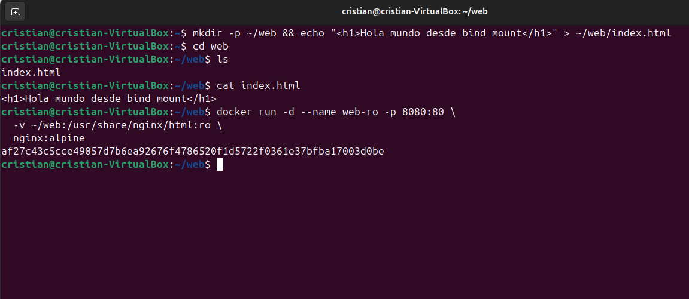

2. Abra http://localhost:8080 y verifique. 

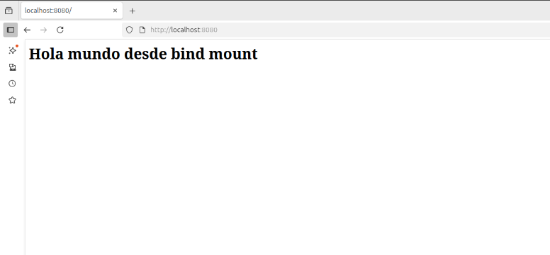

3. Edite index.html en el host y recargue el navegador, el cambio debe verse. 

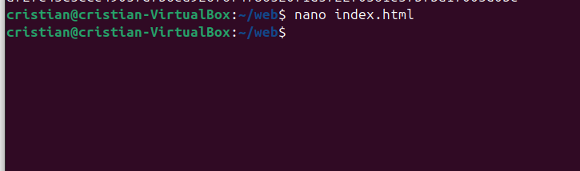

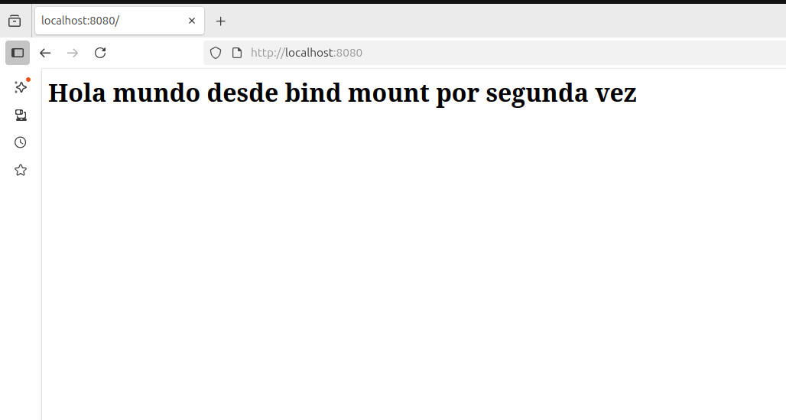

4. Intente crear un archivo dentro del contenedor.

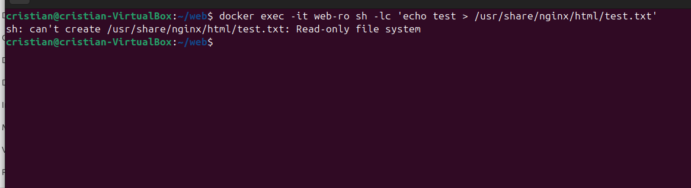

## Ejercicio 2 - Named volume con PostgreSQL

**Pasos:**

1. Cree un volumen.

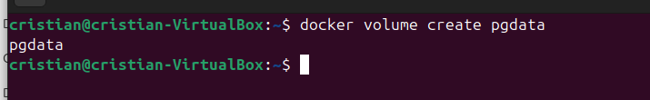

2. Ejecute PostgreSQL.

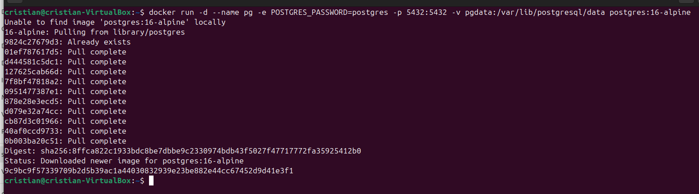

3. Cree una tabla y agregue datos.

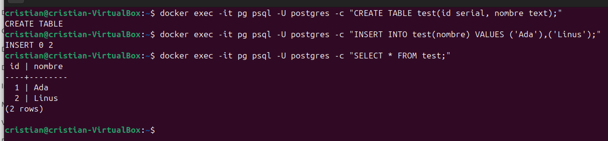

4. Elimine el contenedor.

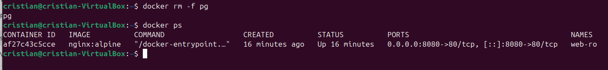

5. Vuelva a levantarlo usando el mismo volumen y verifique que los datos siguen allí.

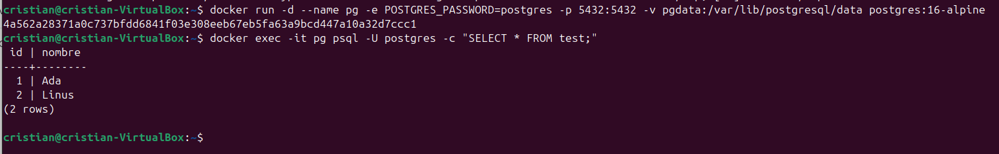

## Ejercicio 3 - Volumen compartido entre dos contenedores

**Pasos:**

1. Cree un volumen.

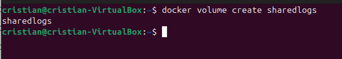

2. Productor (escribe timestamps cada segundo).

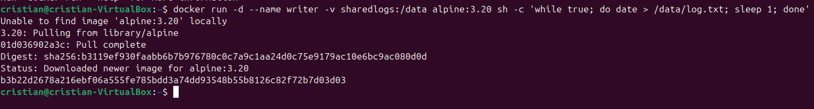

3. Consumidor (lee en tiempo real).

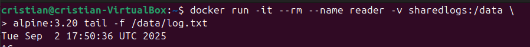

4. Reinicie el productor y revise que el archivo siga creciendo.

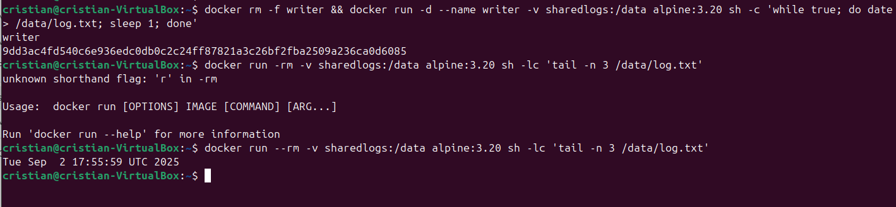

## Ejercicio 4 — Backup y restauración de un volumen

**Pasos:**

1. Cree un volumen y añade un archivo.

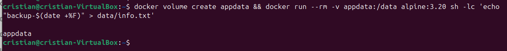

2. Haga backup a un tar en el host.

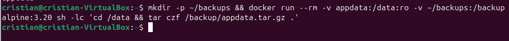

3. Restaure en un nuevo volumen.

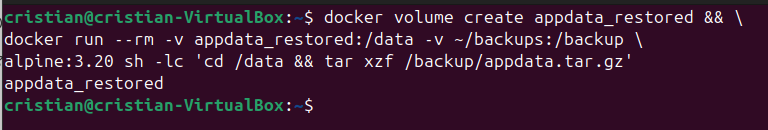

4. Verifique el contenido restaurado.

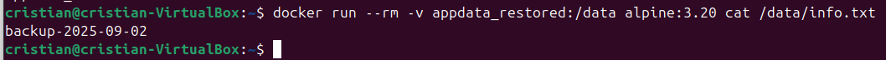

## Reflexion:
- Durante el desarrollo del taller pude reforzar conceptos clave sobre cómo los contenedores manejan la persistencia de datos y cómo se comunican con el sistema host, adicionalmente aprendí que los volúmenes son la clave para mantener datos persistentes. Los problemas que tuve fueron principalmente de sintaxis en Bash (saltos de línea con \, redirecciones, y separación de comandos), pero al entender cómo funciona el shell pude resolverlos.